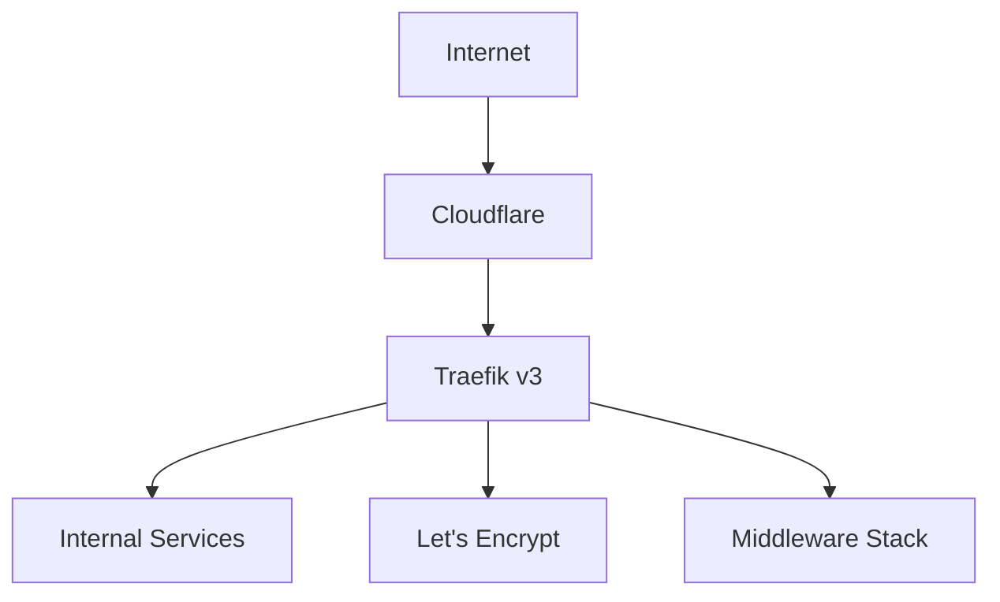
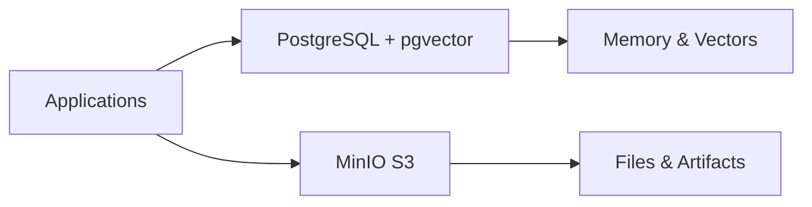
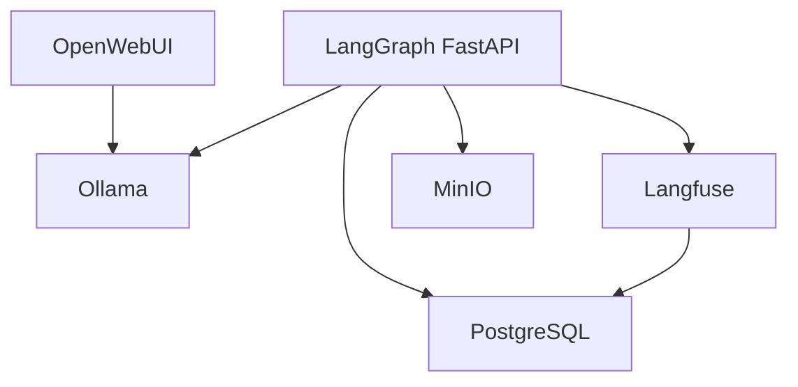
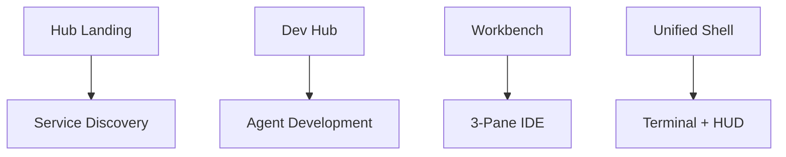
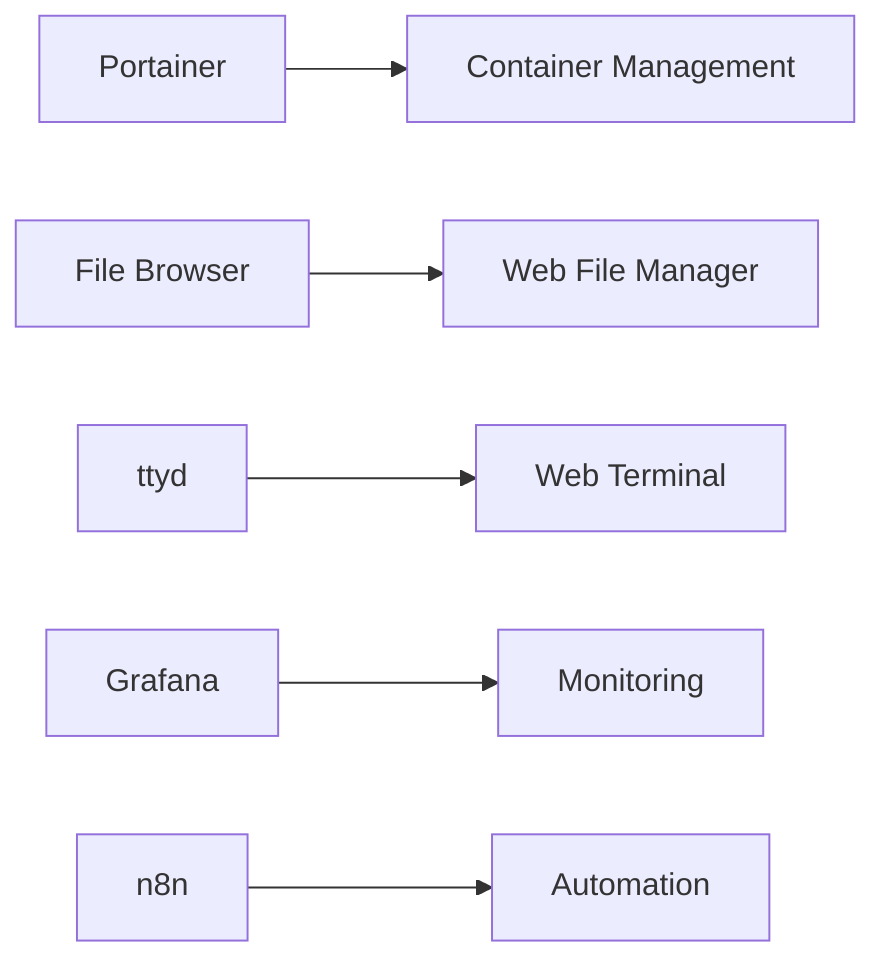
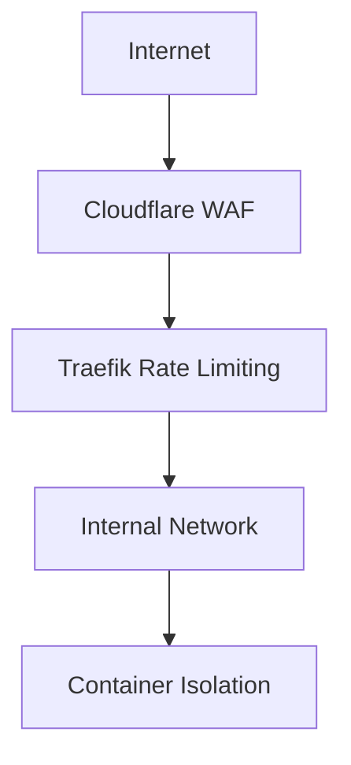
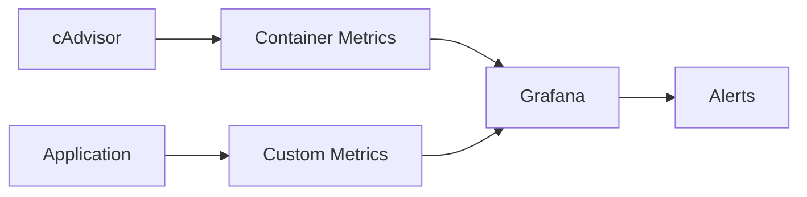
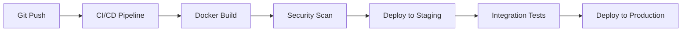

# 🏗️ Architecture Overview - Millyweb Homelab

Deep-dive into the technical architecture, design decisions, and implementation details of the Millyweb Homelab infrastructure.

## 🎯 Design Philosophy

### **Cloud-Native Principles**
- **Containerization**: All services run in Docker containers
- **Microservices**: Loosely coupled, independently deployable services
- **Infrastructure as Code**: Declarative configuration management
- **Observability**: Comprehensive monitoring and logging
- **Security by Design**: Zero-trust networking and encryption

### **AI-First Architecture**
- **Vector Database**: pgvector for semantic search capabilities
- **LLM Integration**: Local model hosting with Ollama
- **Agent Framework**: LangGraph for complex AI workflows
- **Conversation Memory**: Persistent chat history and context
- **Tool Ecosystem**: Extensible agent capabilities

## 🏢 Infrastructure Layers

### **Layer 1: Network & Routing (Traefik)**


**Components:**
- **Traefik v3**: Modern reverse proxy with automatic SSL
- **Cloudflare**: DNS-01 challenge for wildcard certificates
- **Dynamic Middleware**: Security headers, rate limiting, CORS
- **Service Discovery**: Automatic container detection

**Key Features:**
- Automatic SSL certificate generation and renewal
- Dynamic service routing based on Docker labels
- Advanced middleware for security and performance
- Real-time configuration updates

### **Layer 2: Data Persistence**


**PostgreSQL + pgvector:**
- Primary database for all application data
- Vector embeddings for semantic search
- ACID compliance for data integrity
- Optimized for AI workloads

**MinIO Object Storage:**
- S3-compatible file storage
- Lifecycle policies for automatic cleanup
- Multi-tenant bucket organization
- Integration with AI tools

### **Layer 3: AI & Compute Services**


**Core LLM Stack:**
- **Ollama**: Local LLM hosting and inference
- **OpenWebUI**: User-friendly chat interface
- **Model Management**: Automated downloading and updates

**LangGraph Application:**
- **FastAPI Backend**: RESTful API for AI interactions
- **Agent Framework**: Complex workflow orchestration
- **Tool Integration**: File system, web search, shell access
- **Memory System**: Conversation history and context

**Observability:**
- **Langfuse**: LLM conversation tracking and analytics
- **Performance Monitoring**: Token usage and response times
- **Debugging Tools**: Conversation replay and analysis

### **Layer 4: User Interface**


**UI Components:**
- **Hub**: Central landing page with service health
- **Dev Hub**: Development dashboard with agent tiles
- **Workbench**: Integrated development environment
- **Unified Shell**: Terminal interface with overlay

### **Layer 5: Supporting Services**


## 🔄 Service Orchestration

### **Startup Dependencies**
```yaml
# Dependency Graph
traefik:
  dependencies: []
  
memory:
  dependencies: [traefik]
  
minio:
  dependencies: [traefik]
  
core-llm:
  dependencies: [traefik, memory]
  
langgraph-app:
  dependencies: [traefik, memory, minio, core-llm]
  
observability:
  dependencies: [traefik, memory]
  
ui-components:
  dependencies: [traefik, langgraph-app]
```

### **Health Check Strategy**
Each service implements:
- **Container health checks**: Docker HEALTHCHECK directives
- **Application readiness**: HTTP endpoints for load balancer checks
- **Dependency verification**: Wait-for scripts to ensure proper startup order
- **Graceful degradation**: Fallback behaviors when dependencies are unavailable

## 🔐 Security Architecture

### **Network Security**


**Defense in Depth:**
- **Cloudflare WAF**: DDoS protection and traffic filtering
- **Traefik Middleware**: Rate limiting and security headers
- **Container Isolation**: Network segmentation between services
- **Least Privilege**: Minimal container permissions

### **Authentication & Authorization**
- **Cloudflare Access**: Enterprise-grade authentication (optional)
- **Service-Level Auth**: Individual service authentication
- **API Security**: Token-based authentication for APIs
- **Resource Isolation**: User-specific data segregation

### **Data Encryption**
- **TLS Everywhere**: End-to-end encryption for all communications
- **Certificate Management**: Automatic renewal and rotation
- **Database Encryption**: Encrypted storage for sensitive data
- **Secret Management**: Environment variable isolation

## 📊 Monitoring & Observability

### **Metrics Collection**


**Monitoring Stack:**
- **cAdvisor**: Container resource monitoring
- **Grafana**: Visualization and alerting
- **Application Metrics**: Custom business metrics
- **Log Aggregation**: Centralized logging with Docker

### **AI Observability**
- **Langfuse**: Conversation tracking and analytics
- **Token Usage**: Cost monitoring and optimization
- **Performance Metrics**: Response times and throughput
- **Error Tracking**: Failed requests and debugging

## 🚀 Scalability Design

### **Horizontal Scaling**
Services designed for:
- **Stateless Architecture**: Easy horizontal scaling
- **Load Balancing**: Traefik automatic load distribution
- **Database Scaling**: Read replicas and connection pooling
- **Caching Strategies**: Redis integration ready

### **Resource Management**
```yaml
# Resource Allocation Strategy
services:
  web_services:
    cpu_limit: 0.5
    memory_limit: 512M
  
  database_services:
    cpu_limit: 2.0
    memory_limit: 2G
  
  ai_services:
    cpu_limit: 4.0
    memory_limit: 8G
```

### **Performance Optimization**
- **Container Resource Limits**: Prevent resource starvation
- **Database Optimization**: Indexed queries and connection pooling
- **Static Asset Caching**: CDN integration ready
- **API Response Caching**: Redis caching layer ready

## 🔄 DevOps & Automation

### **Deployment Pipeline**


**Automation Features:**
- **Infrastructure as Code**: All configurations in Git
- **Automated Deployments**: Zero-downtime rolling updates
- **Health Monitoring**: Automatic rollback on failure
- **Backup Automation**: Scheduled data backups

### **Configuration Management**
- **Environment Variables**: Centralized configuration
- **Secret Rotation**: Automated password updates
- **Feature Flags**: Runtime behavior modification
- **A/B Testing**: Canary deployments ready

## 🔮 Future Extensibility

### **Planned Enhancements**
- **Multi-Node Deployment**: Kubernetes migration path
- **Advanced AI Features**: Custom model fine-tuning
- **Real-Time Collaboration**: WebSocket integration
- **Mobile Applications**: React Native compatibility

### **Integration Points**
- **External APIs**: Webhook and REST API support
- **Third-Party Services**: OAuth integration ready
- **Data Pipeline**: ETL job scheduling with n8n
- **Notification Systems**: Slack, Discord, email alerts

## 📚 Technology Stack

### **Core Technologies**
| Component | Technology | Version | Purpose |
|-----------|------------|---------|---------|
| **Containerization** | Docker | 24.0+ | Service isolation |
| **Orchestration** | Docker Compose | 2.20+ | Multi-container apps |
| **Reverse Proxy** | Traefik | 3.0+ | Routing & SSL |
| **Database** | PostgreSQL | 15+ | Primary data store |
| **Vector DB** | pgvector | 0.5+ | AI embeddings |
| **Object Storage** | MinIO | RELEASE.2023+ | File storage |
| **LLM Runtime** | Ollama | 0.1+ | AI model hosting |
| **AI Framework** | LangGraph | 0.1+ | Agent workflows |
| **Monitoring** | Grafana | 10.0+ | Metrics & dashboards |
| **Observability** | Langfuse | 2.0+ | LLM analytics |

### **Development Stack**
| Component | Technology | Purpose |
|-----------|------------|---------|
| **Frontend** | HTML5, CSS3, JavaScript | UI components |
| **Backend** | Python, FastAPI | API services |
| **Database ORM** | SQLAlchemy | Database abstraction |
| **Task Queue** | Celery (ready) | Background jobs |
| **Caching** | Redis (ready) | Performance optimization |
| **Search** | Elasticsearch (ready) | Full-text search |

---

**🏗️ Built for Scale, Security, and AI-First Development**
